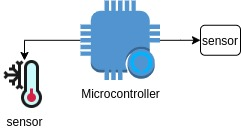
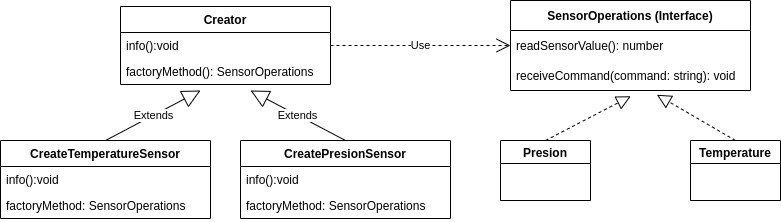

# Factory pattern

## **Problem**
The problem to resolve in this section is the next:

I have some sensors connected to an IoT device, each sensor receive a command and read its value, however, the device accepts multiple sensors because has multiple I/O ports.

--------
## **Solution**
The objects (sensors) can not create directly, instead, their creation is the responsibility of the especial class factory (in our example it is called Create)

